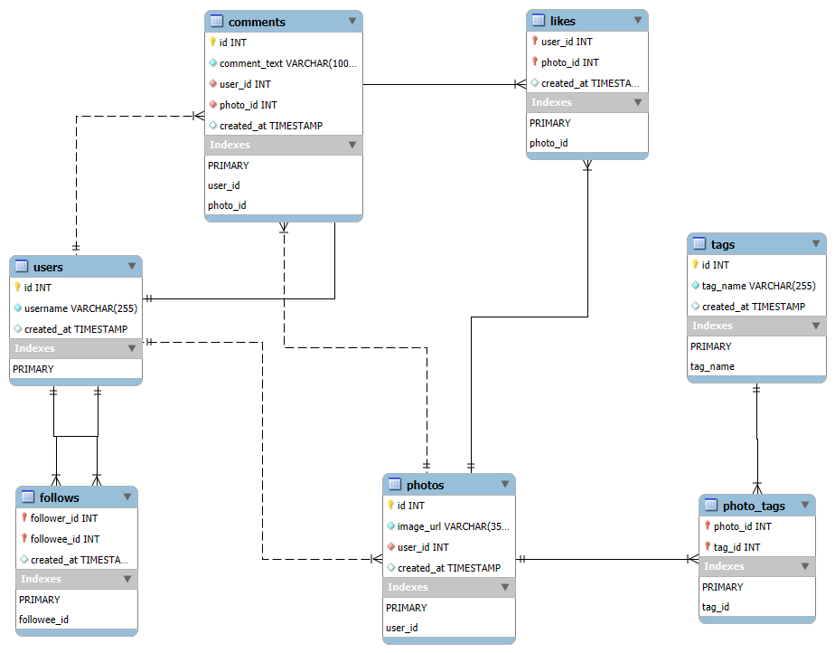

# 📊 Social Media User Engagement Analytics (SQL Project)

### 👨‍💻 Sai Buvanesh  

---

## 🧠 Project Overview

This project models and analyzes **social media engagement data** using **SQL**.  
It simulates a platform where users interact through likes, comments, follows, and hashtags — and transforms that data into insights using structured queries in **MySQL**.

The goal was to design a **normalized relational database**, perform **ETL and data validation**, and write **analytical SQL queries** to understand **user behavior, engagement trends, and content performance**.

---

## ⚙️ Tools & Technologies Used

| Category | Tools / Technologies |
|-----------|----------------------|
| **Database** | MySQL |
| **Environment** | MySQL Workbench |
| **Data Source** | CSV Files |
| **ETL Method** | `LOAD DATA LOCAL INFILE` |
| **Query Types** | DDL, DML, DQL, Joins, Aggregations, Subqueries |

---

## 🧩 Project Structure

social-media-engagement-sql/
│
├── database_setup.sql # Database creation, schema, and data import
├── analytics_queries.sql # Analytical SQL queries and insights
│
├── assets/
│ ├── database_schema_diagram.png # Entity Relationship Diagram
│ └── entity_relationship_summary.docx # Full documentation of schema and analysis
│
├── data/ # Raw data files (used for import)
│ ├── users.csv
│ ├── photos.csv
│ ├── likes.csv
│ ├── follows.csv
│ ├── comments.csv
│ └── tags.csv
│
└── README.md # Project documentation

**ER Diagram:**  


---

## 💡 Key Outcomes

- Designed a **realistic, normalized database** for engagement tracking  
- Performed **ETL and data validation** within MySQL  
- Executed analytical queries to explore **behavioral and temporal trends**  
- Delivered structured insights reflecting **real-world engagement data**  
- Strengthened skills in **SQL**, **data reasoning**, and **relational modeling**

---

## 🧰 How to Run the Project

### 1️⃣ Clone the Repository
```bash
git clone https://github.com/<your-username>/social-media-engagement-sql.git
cd social-media-engagement-sql

2️⃣ Open in MySQL Workbench
3️⃣ Execute the Setup File
SOURCE database_setup.sql;

4️⃣ Enable Local Import (if needed)
SET GLOBAL local_infile = 1;

5️⃣ Run Analytical Queries
SOURCE analytics_queries.sql;


Then, explore results section by section to view user, engagement, and content insights.
